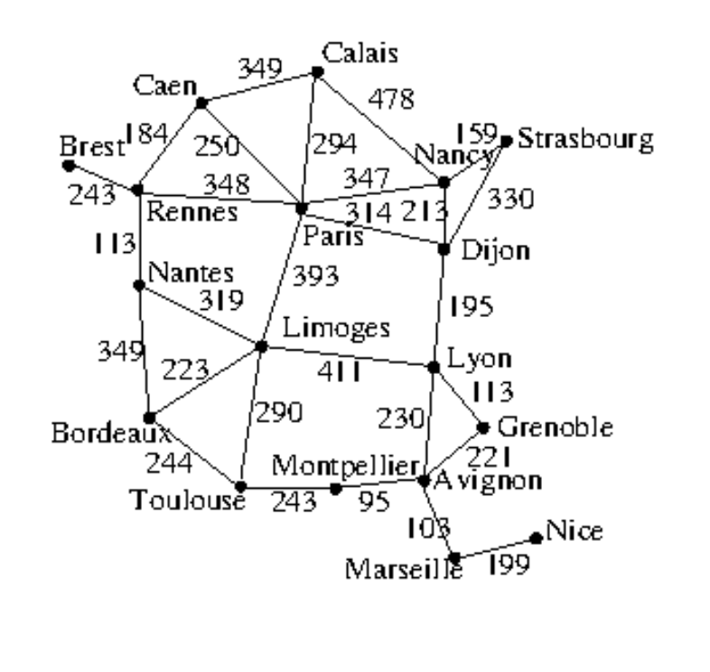

 CS331

Spring 2024

Programming Assignment 1 – Search

Due April 22nd at 11:59pm PST

<h1 align="center">PROCEDURES AND LATE POLICY REMINDER</h1>

* Turn-in: Please commit your final working code to GitHub classroom
(https://classroom.github.com/a/JQF7KaHD) by the deadline.
* Deadline: The on-time deadline for all students is 11:59pm PST on the due date.
* Late policy: Assignments turned in after the deadline will be accepted but penalized
20% per day. Once the solutions have been given, a late assignment will not be accepted.
Problem Statement

In this assignment, we are going on vacation to France. Bon voyage, je vous attends!
We need to know the best ways to get around, and we only know coordinates and relative
distances between certain cities. Your job is to create an agent that uses uninformed and
informed search algorithms to find a path from any given city to any other, or return null if there
is no path. For this and every assignment, you must implement your solution using only the
standard libraries that Python3 provides. If you want to use external libraries, please ask me first.
You may use any version of Python3 that suits you, but I will use Python 3.11 for grading.
Your solution must work for any state-space search problem, so be sure to create classes in your
code that are abstract enough to use for other problems (for instance, you will at least need a
class that keeps track of the map, a class that keeps track of each city, and a class that defines the
actions that an agent can take).
The map that you will use for this assignment is pictured below and takes the form of a weighted
graph:

Your agent must use multiple different types of search:
1. Breadth-first search (bfs)
2. Iterative deepening depth-limited search (dls)
3. Uniform-cost search (ucs) (you can find this algorithm in your book, or in the Search
module)
4. A* search (astar)

The main function of your code should allow for the type of search to be passed as a parameter from the command line (the name of each option is in parentheses above), and the default value should be bfs. The main function should also take as an argument the start and end cities (-A and -B respectively). Your main function should also take as a required argument the name of a file that defines the map. You will be loading in the data needed to create your map from a file called france.txt. Each line contains a city and its coordinates, followed by edges that connect
that city to another, and the distance from the first city to the second. You can assume that any map file that your agent is tested on will be of the same structure as the france.txt file. In your main function, if no initial and goal city parameters (-A and -B) are passed in, you should compute the path between following initial and goal cities, using all search methods:
1. Brest -> Nice
2. Montpellier -> Calais
3. Strasbourg -> Bordeaux
4. Paris -> Grenoble
5. Grenoble -> Paris
6. Brest -> Grenoble
7. Grenoble -> Brest
8. Nice -> Nantes
9. Caen -> Strasbourg

For any initial and goal city, the agent should compute the solution (the path, as a list of cities), the cost of the path, and:
1. The number of nodes explored, entered, or visited (i.e., the number of nodes removed
from the frontier)
2. The number of nodes expanded (i.e., the total number of successors)
3. The number of nodes maintained (i.e., stored in the frontier)
For the nine city pairs defined above, your main function should write the path, the cost, and the other three metrics above to a plain text file called solutions.txt, and you should include that file in your submission.

For each search method over the nine city pairs, your main function should compute the
following:
1. The average number of nodes explored or entered (i.e., the number of nodes removed from the frontier)
2. The average number of nodes expanded (i.e., the total number of successors)
3. The average number of nodes maintained (i.e., stored in the frontier)
4. The number of times it found the optimal solution (optimal here is measured as “found the best solution out of the four search algorithms)

Write these averages to a plain text file named README. Write a paragraph comparing the search algorithms in terms of these metrics. What are the pros and cons of each algorithm? Include this file in your submission.

Deliverables:

You should submit everything below to your GitHub classroom repository:

https://classroom.github.com/a/JQF7KaHD
1. README File
2. Solutions file
3. Python code (multiple files)
4. france.txt file

# Dalton Answers
1. The average number of nodes explored or entered (i.e., the number of nodes removed from the frontier)
    * AVERAGE BFS EXPLORED: 10.333333333333334
    * AVERAGE IDLS EXPLORED: 147.88888888888889
    * AVERAGE UCS EXPLORED: 15.88888888888889
    * AVERAGE ASTAR-E EXPLORED: 8.333333333333334
    * AVERAGE ASTAR-H EXPLORED: 9.222222222222221

2. The average number of nodes expanded (i.e., the total number of successors)
    * AVERAGE BFS EXPANDED: 35.111111111111114
    * AVERAGE IDLS EXPANDED: 148.77777777777777
    * AVERAGE UCS EXPANDED: 49.111111111111114
    * AVERAGE ASTAR-E EXPANDED: 26.0
    * AVERAGE ASTAR-H EXPANDED: 29.22222222222222

3. The average number of nodes maintained (i.e., stored in the frontier)
    * AVERAGE BFS MAINTAINED: 12.222222222222221
    * AVERAGE IDLS MAINTAINED: 148.77777777777777
    * AVERAGE UCS MAINTAINED: 17.22222222222222
    * AVERAGE ASTAR-E MAINTAINED: 13.11111111111111
    * AVERAGE ASTAR-H MAINTAINED: 14.333333333333334

4. The number of times it found the optimal solution (optimal here is measured as “found the best solution out of the four search algorithms)
    * bfs was optimal 2 times.
    * idls was optimal 3 times.
    * ucs was optimal 6 times.
    * astar_e was optimal 8 times.
    * astar_h was optimal 8 times.

The A-star algorithm is the most accurate of the bunch, as it should find the optimal answer every time if the heuristic is implemented correctly. However, my implementation must have an error that I could not see after hours of searching, and my implementation is not returning the optimal answer every time. To try and fix this, I went through and disabled the heuristic calculations by setting them to 0. It then came up with the same result as UCS, leading me to believe that my heuristic was implemented incorrectly. I spent 2 hours looking over the heuristics and even wrote some tests to see if it would return the expected answers, and it did. However, without the limitations of my implementation, this would be one of the best searching methods as it decreases the space complexity by pruning certain paths using the heuristic. However, UCS did come up with an answer that was more optimal in one situation; it did not come up with as many optimal answers as often as A-star. The iterative-deepening search used a ton of memory space as it had the highest averages of the explored, maintained, and expanded nodes. This seems to occur because of the way it iterates through depths. If you explore all of the nodes up to a certain depth and then increase the maximum depth, you are running the same nodes repeatedly allowing for more of them to be loaded in and out of memory by the agent. BFS did operate slightly better than I thought it would, but because it is an uninformed search it might provide less than optimal answers.

